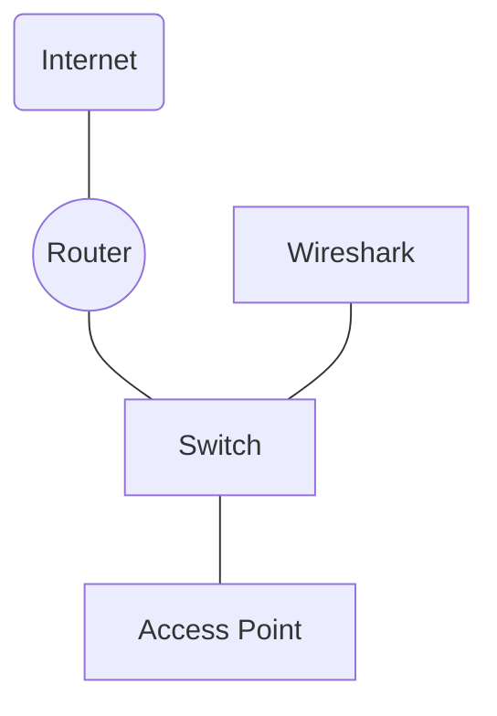
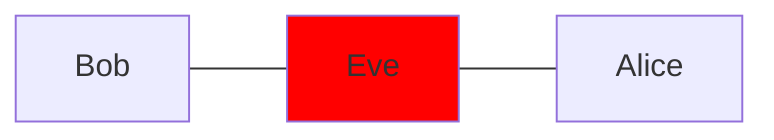

```toc
```
## Computernetwerken
### CIA
De CIA beschermd de [[BIV]] factoren
### Dreiging
- Opzet
- Menselijke falen
- Technische falen
- Externe oorzaken

---

## Trends in cyberaanvallen
### Methodes
Veel oude aanvals methodes blijven werken door een tekort aan kennis of moeite.
Voorbeelden van aanvallen in de laatste jaren zijn **[[ransomware of cryptoware]]**,**aanvallen op [[IoT]]**, **supply chain attacks**

Ook worden er vaak bots gebruikt om deze aanvallen uit te voeren.

### Reden
Een grote reden voor cyberaanvallen is voor dingen zoals cyber terrorisme. En aanvallen op overheden. Daarnaast wordt het vaak gebruikt om geld te krijgen.

---
![[APT]]

---
## Sniffing



## Spoofing
Het misleiden van het netwerk waardoor dit denkt dat je een andere gebruiker bent

## MITM (Man In The Middle)



Eve is hier de [[MITM]] en luisterd de berichten tussen Alice en Bob af.

---

## Eind systemen aanvallen
### Overnemen van systemen (pwnd)
je kunt een systeem overnemen met [[Malware]], cyberaanvallen 

---

Een paar methodes andere methodes zijn [[Trojan]], [[Phising]], [[Whaling]], [[Smishing]], 
[[Vishing]], [[HOAX]], [[Botnet]] , [[C&C]].