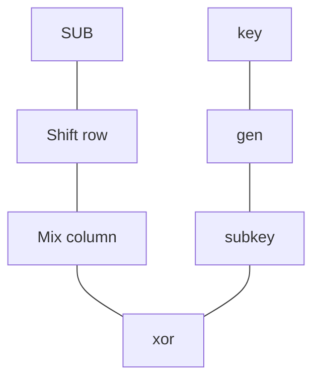
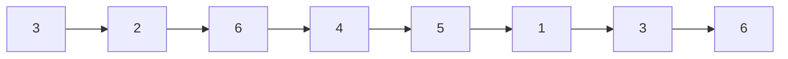
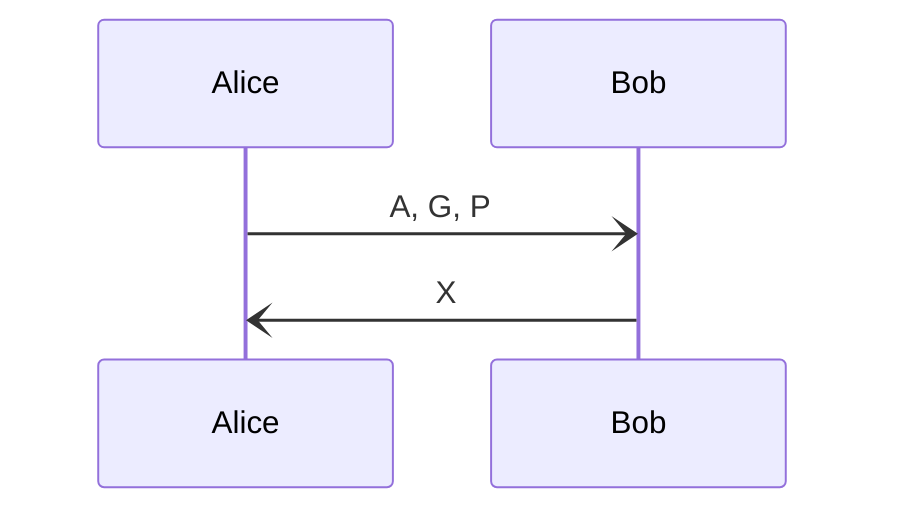

# Asymetrische cryptografie
Problemen met MAC zijn dat je vooraf de key moet uitwisselen anders kan je de encryptie niet decrypten.

### Cryptografie gebasseerd op getaltheorie
Je neemt een getal bijvoorbeeld 91 wat zijn $a\cdot{b}=91$. Dit is lastig snel te bedenken en benodigd brute force om tot het antwoord $17\cdot{3}=91$ te krijgen.

### Machtsverheffen & Grote getallen
Bij het gebruik van machtsverheffen krijg je grote getallen wat tot overflows kaan leiden.

### Reeks en herhalen
$\mathbb{Z}_{n}$ waarbij n de limiet is van het getalruimte gaat via de natuurlijke getallen. $\mathbb{N}={1,2,3,4,5,...}$. Stel je neemt $\mathbb{Z}_{7}={1,2,3,4,5,6}$ dan wordt de reeks.

En dan herhaald het.

### Diffie Helmann Key Exchange

$B^{x}=(g^{y})^{x}=g^{yx}$

## Certificaat keten

