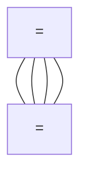
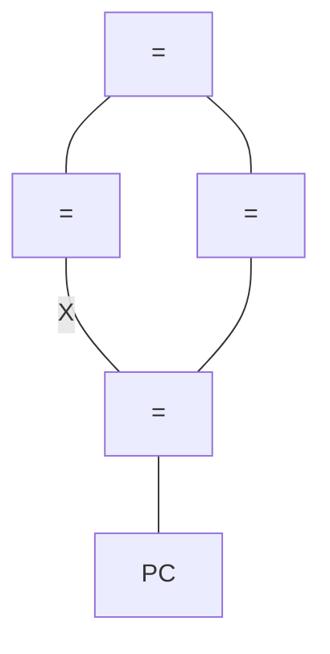
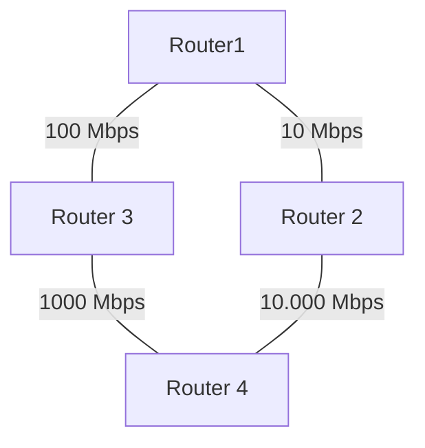

```toc
```
#routers


#SpanningTree 


## Spanning Tree Protocol
Spanning Tree Protocollen voorkomen switching loops. Door een poort te blokkeren in een broadcast domain wordt een loop voorkomen. Zie #SpanningTree .
Een blocked poort stuurt geen user data

Het nadeel van Spanning Tree is dat dit lang duurt.

### Show Spanning Tree
Als de $\frac{BID}{4096}\neq\mathbb{N}$ dan is het restant het MAC-adres 

```bash
Switch#show spanning-tree summary
```
Het commando hierboven geeft het volgende resultaat
![[Pasted image 20230307113659.png]]

### Portfast
Dan gaat hij sneller over van de learning state naar de forwarding state.
```bash
Switch(config)#int fa0/0
Switch(config-if)#spanning-tree portfast
```
Of
```bash
Switch(config)#int fa0/0
Switch(config-if)#spanning-tree default
```

### RSTP
| STP | RSTP |
| --- | ---- |
|     |      |

---

## BPDU
- BID = Bridge Identifier = <a style="color:inherit;font-weight:bold">Priority en MAC-adres</a>
- Priority range: 1-32768 (in stappen van 4096); default = **32678**


1. <a style="color:inherit">laagste</a> waarde wint
2. Priority waardes worden eerst vergeleken, als gelijk dan wordt naar het MAC-adres gekeken (de bridge-ID bestaat uit deze twee componenten, ze worden niet opgeteld).
3. <a style="color:inherit">BID</a> is belangrijker dan <a style="color:inherit">root-path-cost</a> is belangrijker dan <a style="color: inherit">port-ID</a>

---

## STP Werking
- Fase 1: kiezen van de **root bridge** (aka root war)
- Fase 2: kiezen van de **root ports** (ports die “wijzen” naar de root bridge) op non-root bridges
- Fase 3: kiezen van **designated ports** (ports die wijzen vanaf de root bridge) per segment en **blokkeren** van de overgebleven poorten

---

### Fase 1: Root Bridge 
De root bridge is de laagste BID en hierbij word het MAC-adres van VLAN 1 gebruikt.

### Fase 2: Root Ports
Er wordt niet gekeken naar de snelste verbinding maar naar de route met het hoogste *root-path-cost*.

| Bandbreedte | Cost |
| ----------- | ---- |
| 10 Mbps     | 100  |
| 100 Mbps    | 19   |
| 1000 Mbps   | 4    |
| 10.000 Mbps | 2    |



### Fase  3: Kiezen van designated poorten
- Alle poorten van de root bridge zijn designated ports 
- 
- Voor de overgebleven links bepaalt de senderBID welke poort actief mag blijven (*designated*) en welke poort uitgeschakeld moet worden (*blocked*). 

- Als een switch d.m.v. twee links verbonden is met een andere switch, dan is er ook sprake van een lus en zal de port-ID bepalen welke poort actief blijft (*designated*) en welke uitgeschakeld wordt (*blocked*)

---
