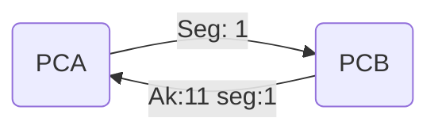
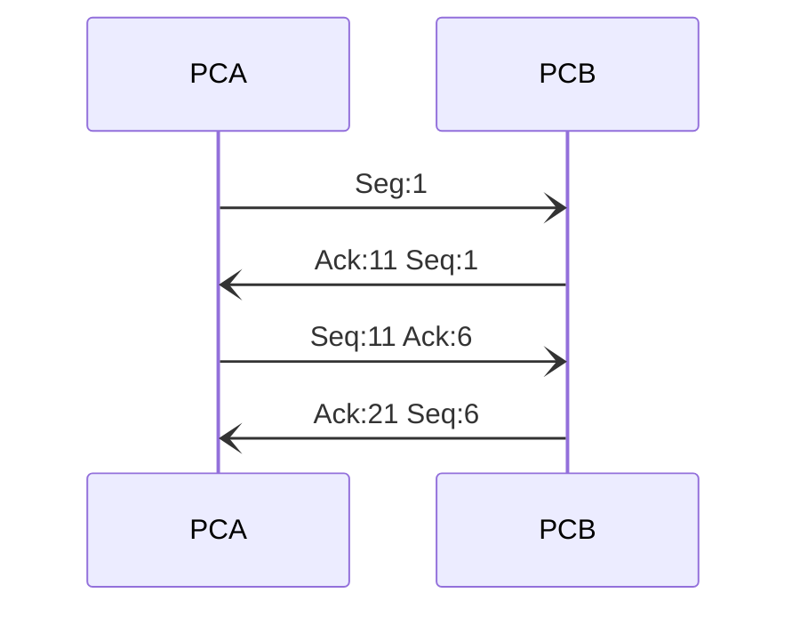
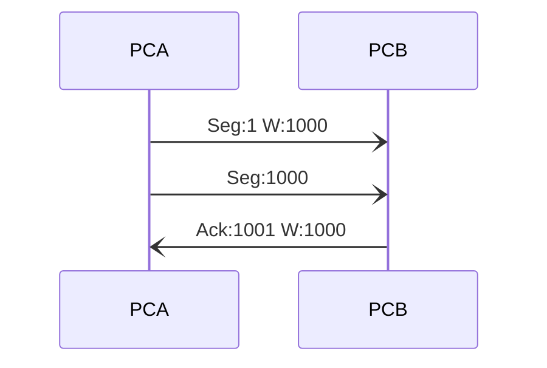
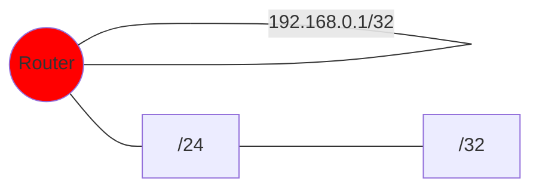
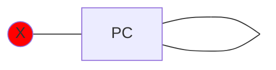

### Sequencing 1

```mermaid
flowchart LR
1(PCA) -->|Seg: 1| 2(PCB)
2 -->|Ak:11 seg:1| 1
```

### Sequencing  2

```mermaid
sequenceDiagram
PCA-)PCB: Seg:1 
PCB-)PCA: Ack:11 Seq:1
PCA-)PCB: Seq:11 Ack:6
PCB-)PCA: Ack:21 Seq:6
```

### Sequencing 3

```mermaid
sequenceDiagram
PCA-)PCB: Seg:1 W:1000
PCA-)PCB: Seg:1000
PCB-)PCA: Ack:1001 W:1000
```

### Loopback

```mermaid
flowchart LR
1((Router))---|192.168.0.1/32| 1
1---/24---/32
style 1 fill:red
```

```mermaid
flowchart LR
1((X))---2[PC]---2
style 1 fill:red
```

Een loopback is het kleinste subnet en wordt gebruikt om op 1 computer een netwerk te maken.

---

