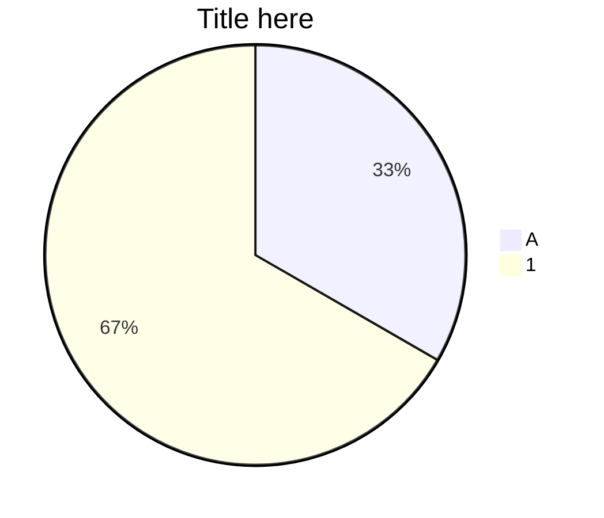
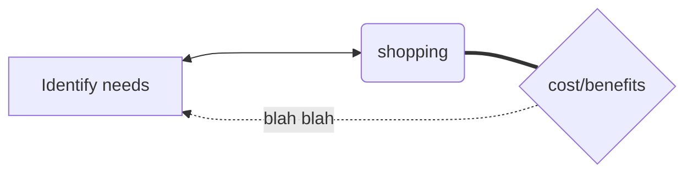
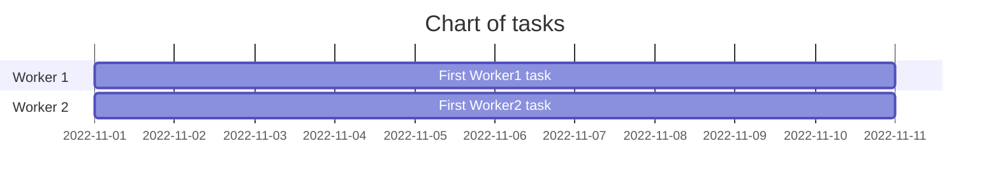
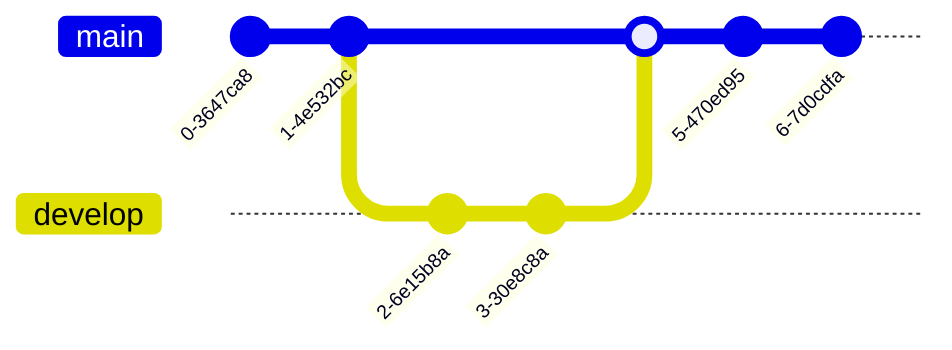
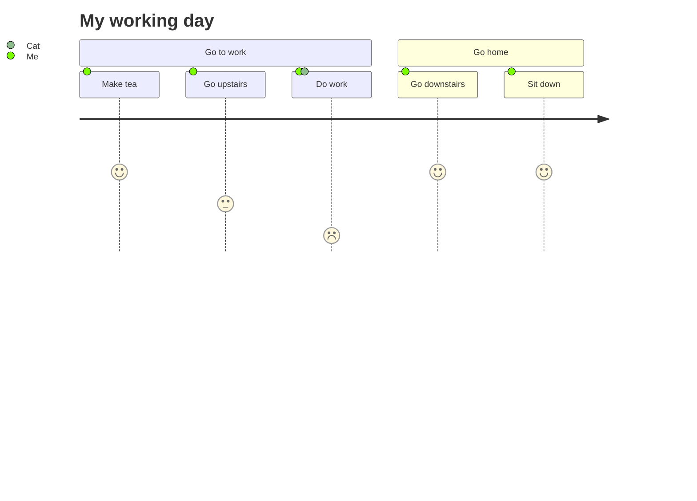
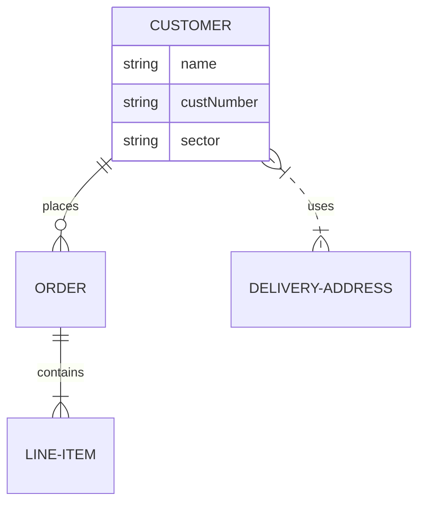

```mermaid
pie title Title here
"A" : 100
"1" : 200
```

```mermaid
flowchart LR
A[identify needs] <---> B(shopping) === C{cost/benefits}
C{cost/benefits} -.blah blah.-> A[Identify needs]
```

```mermaid
gantt
	title Chart of tasks
	dateFormat DDMMYYYY
	section Worker 1
	First Worker1 task :01112022, 10d
	section Worker 2
	First Worker2 task :01112022, 10d
```

```mermaid
gitGraph
        commit
        commit
        branch develop
        checkout develop
        commit
        commit
        checkout main
        merge develop
        commit
        commit

```

```mermaid
journey
        title My working day
        section Go to work
          Make tea: 5: Me
          Go upstairs: 3: Me
          Do work: 1: Me, Cat
        section Go home
          Go downstairs: 5: Me
          Sit down: 5: Me

```

```mermaid
erDiagram
        CUSTOMER ||--o{ ORDER : places
        ORDER ||--|{ LINE-ITEM : contains
        CUSTOMER }|..|{ DELIVERY-ADDRESS : uses

    CUSTOMER {
            string name
            string custNumber
            string sector
        }

```
