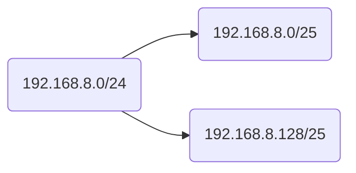
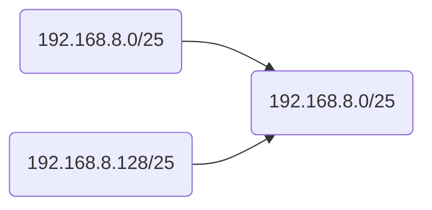
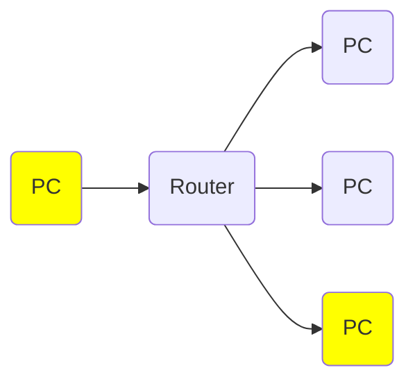

```toc
```

---
## Cybersecurity
### Cybersecurity (week 1)
#### Inleiding
In week 1 werd er een korte herhaling van Security essentials gehouden

**Een voorbeeld van Risico**
![[Pasted image 20230301140121.png]]

---

#### Belangrijke begrippen
- **Incident**: Event dat tot schade gaat leiden (zonder verdere maatregelen)
	- *bijv. Host wordt overgenomen (pwnd), website down*
- **(Be)dreiging (threat)**: Oorzaak van een incident (het bestaan van deze oorzaken ligt buiten de controle van de risicopartij)
	- *bijv: malware,  hacker, vijandelijke staat, APT, boze werknemer*
- **Kwetsbaarheid (vulnerability)**: escalatiefactor die de risicopartij  gevoelig maakt voor een bepaalde dreiging;
	- *bijv: bug in de software, slechte configuratie, onvoorzichtige gebruiker*
- **(Beheers)maatregel (control)**: reduceert de <a style="color:inherit">waarchijnlijkheid</a>  van een incident en/of de <a style="color:inherit">impact/gevolgen</a> van een incident.
	- *bijv: firewall, awareness-cursus*
- **Impact/Gevolgen**: (negatief) gevolg van een incident in de vorm van schade aan assets.
	– Informatiebeveiliging: impact vaak uitgedruikt in **B**eschikbaarheid, **I**ntegriteit en **V**eiligheid
	– Cybersecurity : Impact omvat ook anderssoortige gevolgen
	- *bijv: Data onbeschikbaar door onvrijwillige encryptie, Staatsgeheimen opwikileaks, Fabriek plat door een succesvolle malware-attack*

---
####  Beveiligingscyclus
![[Pasted image 20230301142809.png]]

- **Preventieve maatregelen (werken voorafgaand aan het incident)**
	- *niet verwarren met proactieve maatregelen, deze neem je ook voorafgaand aan het incident. Maar deze werken pas tijdens of na het incident*
- **Reactieve maatregelen (werken tijdens of na het incident)** 
	- *= detectieve + repressieve (+ correctieve maatregelen)*

---

#### Logische/Organisatorische/Fysieke Maatregelen 
- Voorbeeld: beveiliging webserver:
	- **Logische maatregelen** (ook wel **Digitale maatregelen**):
		- *encryptie in de communicatie, firewall , software up-to-date, acces control voor gebruikers, AV-solution, IDS, Log-Monitoring*
	- **Organisatorische maatregelen**
		- *Beleid wie toegang heeft tot de serverruimte, IAM(Identity and access management voor users, admins, …), SLA’s (Service Level Agreements) over bijvoorbeeld storing en uitwijk, Security awareness, Scholing*
	- **Fysieke maateregelen**
		- *Server in beveiligde serverruimte met bewaking, slot op de deur, cameratoezicht*

**Schematische weergave van maatregelen**
![[Pasted image 20230301143858.png]]

---

### Cybersecurity (week 2)
Voor meer informatie over cryptografie zie [[Aantekeningen Cyber 1]], [[Aantekeningen Cyber 2]] 
#### Inleiding
In week 2 hebben we het gehad over verschillende methodes voor cryptografie. De voorbeelden die besproken worden zijn: Caesar

#### Substitutie 1 : Caesar
[Meer info...](<Aantekeningen Cyber 1>)
Bij Caesar encryptie word er een vaste verschuiving gebruikt zoals te zien in de afbeelding hieronder. In dit voorbeeld wordt er een verschuiving van <span style="color:red">A →  D</span>. Dit is een verschuiving van 3.
**Voorbeeld**
![[Pasted image 20230301153348.png]]

---

#### Substitutie 2: S-box
[Meer info...](<Aantekeningen Cyber 1>)
S-box cryptografie maakt gebruik van een lookup-table zoals hieronder. 
**Voorbeeld**
![[Pasted image 20230301155038.png]]

---

#### Substitutie 3: Poly-alfabetische substitutie: Vignère
[Meer info...](<Aantekeningen Cyber 1>)
In plaats van een vaste verschuiving zoals bij [[#Substitutie 1 : Caesar]] wordt er met meerdere verschuivigen gewerkt, vandaar **Poly-alfabetisch**.
<span style="color:red">Er zijn 26<sup>n</sup> sleutelmogelijkheden bij keylengte n</span>

**Tabel van Vignère**
![[Pasted image 20230301155703.png]]

**Voorbeeld**
– Stel de sleutel is <span style="font-weight:bold">"nse"</span>. De letters geven drie verschillende Caesaroptellingen aan <span style="color:blue">(n=13, s=18, e=4)</span>. Bij de $4^{e}$ letter van de plaintext, wordt opnieuw de eerste optelling gebruikt.
– Plain text is <span style="font-weight:bold">"hallo"</span> (5 tekens) dus de 5 sleutel-rijen zijn **nsens**. Cyphertext is het snijpunt van plaintextletter en bijbehorende sleutelletter
– Dus hallo ⇒ <span style="font-weight:bold">"uspyh"</span>

---

#### Substitutie 4: Enigma
Meerdere rotors substitueren de letters en draaien steeds zelf verder, er is dus weer sprake van **poly-alfabetisch substitutie**

Je kunt dit alleen met de juiste beginstand van de rotors decrypten.

**Schematische weergave van rotors**
![[Pasted image 20230301161254.png]]

---

#### Vernam
Vernam encryptie is [[#Substitutie 3: Poly-alfabetische substitutie: Vignère]] waarbij <a style="color:inherit">legte van de key = lengte plain text</a> 

---

## Routing & Switching (week 1)
### LAN & WAN

^4bd2cc

- **WAN**
	- "Wide Area Network"
	- ISP (Internet Service Provider)
	- Verbindt netwerken

- **LAN**
	- "Local Area Network"
	- Thuis- of bedrijfsnetwerk
	- Verbindt clients

![[Pasted image 20230306114311.png]]
**Mogelijke fouten in LAN**
- **Collisions** Komen voor bij netwerken met een collision domain groter dan een host en bij een half-duplex verbinding
- **Late collisions** Botsing na de 512<sup>e</sup> byte. Kan voorkomen als de kabel te lang (>100 meter) is, of bij duplex mismatch.
- **CRC errors** Kan ontstaan door verschillende redenen. Bv duplex-mismatch, of door botsingen of storingen (vooral bij draadloze verbindingen)
- **Runts** Een frame korten dan de minimale eis van 64 bytes. Ontstaat bij een collision. Ethernet framegroote moet altijd tussen 64-1518 bytes zitten
- **Giants** Een frame groter dan 1518 bytes
- **Discards**
---
### Netwerk-infrastructuur
1. **Services view**
2. **Components view**
3. **Protocols view**

#### 1. Services View
```
De technische infrastructuur die bekeken vanuit de diensten die geleverd moet worden
```
![[Pasted image 20230306114642.png]]

##### Aspecten
- Fault tolerance
	- Weerbaarheid van een netwerk tegen fouten/uitval 
	- Moet blijven werken bij als een gedeelte uitvalt
- Beschikbaarheid (availability)
	- Beschikbaarheid van de services 
	- Moet blijven werken bij als een gedeelte uitvalt
- Schaalbaarheid (scalability)
- Quality of service 
- Beveiliging (security)
	- Vertrouwelijkheid 
		- De data is niet toegankelijk voor onbevoegden
	- Integriteit 
		- De data verandert niet onderweg
	- Beschikbaarheid
		- Het werkt zoals het zou moeten werken

De belangrijkste manier om Fault tolerance en beschikbaarheid te behouden is redundancy (redundantie). Hierbij heb je een backup voor als de hoofd apparatuur niet werkend is.

---
#### 2. Components View


---
#### 3. Protocols View
Op een computernetwerk gebruikt software databussen. Maar het daadwerkelijke transport gaat via elektromagnetische golven door bv: *fiber, kabel, ether*.
Netwerk -hardware en Software vertaalt de informatie behoefte van de applicatie naar elektrische signalen die worden verzonden via elektromagnetische golven.
Om dit te doen hebben we <a style="color:inherit">netwerkprotocollen</a> nodig.

**Representatie van Protocols View (Layered View)**
![[Pasted image 20230306115601.png]]
##### Osi model
**Lagen van het OSI model**
![[Pasted image 20230221112047.png]]

Elke laag van het OSI model levert een service aan de laag eronder

###### Voordelen
- Protocollen worden per laag ontwikkeld dus een verandering van een protocol hoeft geen gevolgen op de andere lagen te hebben
- Omdat er een gemeenschappelijke manier van communiceren is zorgt dit voor consistentie in de systemen

---

##### Internet model (TCP-IP model / DOD model)
![[Pasted image 20230306120828.png]]
![[Pasted image 20230306120922.png]]

---

##### Inpakken van data (Encapsulation) 

<a style="color:inherit">Applicatie-laag</a> : produceert data en geeft het door aan de Transport-laag 
<a style="color:inherit">Transport-laag</a>: 
- Deelt data op in segmenten 
- Voegt aan elk segment een <b style="color:khaki">header</b> toe en geeft het door aan de Netwerk-laag 

<a style="color:inherit">Netwerk-laag</a>: Voegt een <b style="color:salmon">header</b> toe em geeft het door aan de Datalink-laag 
<a style="color:inherit">Datalink-laag</a> Voegt een <b style="color:darkseagreen">header</b> en een <b style="color:darkseagreen">trailer</b> toe dit wordt doorgegeven aan de Fysieke laag
<a style="color:inherit">Fysieke Laag</a> Voegt bits toe voor error-correctie
---
In de afbeelding hieronder zie je de Encapsulation en decapsulation van de PDU's (Protocol data unit)
![[Pasted image 20230306122638.png]]
---
Eerder werd besproken over collisions bij ![[Network Engineering Deel 1#^4bd2cc]]
Nu gaan we hier verder naar kijken
### Collision vs Broadcast domains

Een switch scheidt <b style="color:lime">collision domains</b> en <a style="color:inherit">geen</a> <b style="color:lightblue">broadcast domains</b>.
![[Pasted image 20230306170220.png]]
In dit voorbeeld zijn er 3 <b style="color:lime">collision domains</b> en 1 <b style="color:lightblue">broadcast domain</b>

#### Scheiden
Er zijn twee manieren om gescheiden broadcast domains te krijgen dit zijn:
- Routers
- Switch: VLAN (Virtual LAN)

Bij VLAN's wordt de switch virtueel verdeelt in kleinere switches zodat elke poort een eigen LAN heeft.

##### Router
Met een router word het broadcast domein verkleint, een broadcast domain is een deel van een netwerk waar alle verstuurde berichten aankomen.
Bij een router worden broadcast berichten <a style="color:inherit">niet</a> doorgegeven naar het volgende netwerk en daarom wordt het broadcast domein gescheiden.

---
## Routing & Switching (W;eek 2)
In week twee hadden we het over subnetten.
### IPV4 adres

#### Netwerkdeel en Hostdeel
Een IP adres bestaat uit een <b style="color:red">Netwerkdeel</b> en een <b style="color:blue">Hostdeel</b> en is in totaal 32 bits lang.
Het **netwerkmasker** bepaalt het netwerkdeel en het hostdeel
Heet net masker bestaat uit een **$\underline{aaneensluitende}$** reeks aan enen gevold door een **$\underline{aaneensluitende}$**  reeks aan nullen. Waarbij de enen het netwerkdeel zijn en de nullen het hostdeel.
![[Pasted image 20230306183721.png]]
Deze enen en nullen zijn binaire getallen die als volgt worden opgeschreven. 
```
11111111.11111111.0000000.000000
```

In dit voorbeeld krijg je de volgende informatie uit het binaire getal
```
Dotted decimal: 255.255.0.0
Prefix: /16
Wildcard: 0.0.255.255
```

#### Adressentypen
**Netwerkadres (subnet)** Bepaalt de range van het hostdeel. En word aangegeven met de prefix.
**Hostadressen:** Adressen die worden gegeven aan de eindgebruikers van een netwerk. De range hiervan is het aantal bits dat over blijft na het instellen van het netwerkadres
**Broadcastadres:** Wordt alleen maar gebruikt om data te versturen naar alle hosts in het netwerk.
---
#### Classful netmaskers
![[Routing & Switching Aantekening Week 2#^e8e8c4]]
In deze tabel is precies te zien waar het netwerkdeel eindigt en het hostdeel begint voor verschillende prefixes.
---
#### Subnet
Voor alle subnetten geld er dat het aantal hosts gelijk is aan $s^{n}$ waarbij n het aantal host bits is. Stel je hebt 24 host bits dan zijn er dus $2^{24}=17777216$ hosts. Ook geld er dat er altijd een netwerkadres is en een broadcastadres.

##### VLSM (Variable length subnetmask)
*Met VLSM kan je*:
**Classless** netwerken definiëren dus de prefix hoeft niet /8, /16 of /24 te zijn. 

---

#### Supernetten
Naast subnetten heb je ook supernetten dit is wanner je netwerken combineert in een groter netwerk

##### Voorbeelden Sub- en  supernetten 
**Subnetten**

**Supernetten**


---
## Routing & Switching (week  3)
In week 3 hebben we het over basic switching en VLAN's gehad
### Netwerk Architectuur
Het in lagen verdelen van een netwerk heeft als voordeel dat elke laag zijn eigen functie heeft. Daarnaast is het makkelijker te beheren en heeft het optimale performance.

![[Routing & Switching Aantekening Week 3#^0f2f32]]

Gebasseerd op dit netwerk kan je elk netwerk maken
#### Lagen

![[Routing & Switching Aantekening Week 3#Acces layer]]
![[Routing & Switching Aantekening Week 3#Distribution layer]]
![[Routing & Switching Aantekening Week 3#Core Layer]]
![[Routing & Switching Aantekening Week 3#High availability]]

![[Routing & Switching Aantekening Week 3#Switches]]


![[Routing & Switching Aantekening Week 3#Symmetrisch]]

![[Routing & Switching Aantekening Week 3#Asymmetrisch switching]]

![[Routing & Switching Aantekening Week 3#Netwerken met VLANs]]

#voorbeeld 


![[Routing & Switching Aantekening Week 3#Speciale VLANs]]

![[Routing & Switching Aantekening Week 3#Trunking]]

![[Routing & Switching Aantekening Week 3#Routeren tussen VLANs]]

![[Routing & Switching Aantekening Week 3#Configuratie voorbeeld router "On a stick"]]
